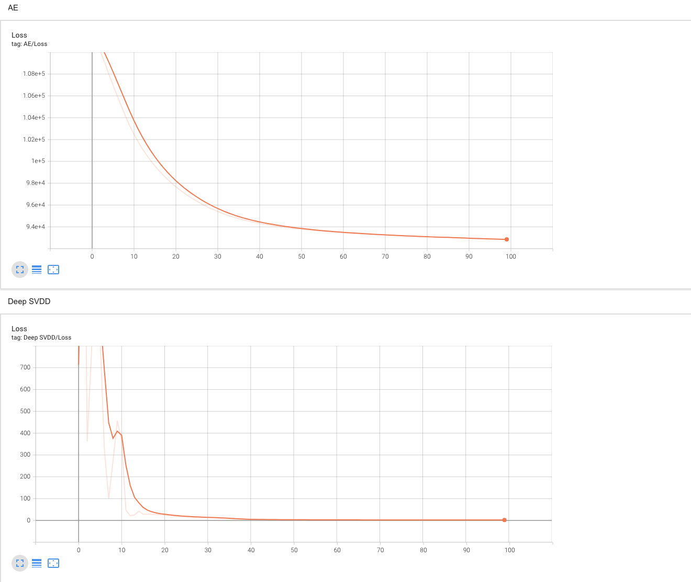

# Deep one class classification Harness cable dataset version

# 1. How to run?

1. Check the **argparser's parameters**
   ~~~
   usage: main.py [-h] [--num_epochs NUM_EPOCHS] [--num_epochs_ae NUM_EPOCHS_AE]
               [--lr LR] [--lr_ae LR_AE] [--weight_decay WEIGHT_DECAY]
               [--weight_decay_ae WEIGHT_DECAY_AE]
               [--lr_milestones LR_MILESTONES] [--batch_size BATCH_SIZE]
               [--pretrain PRETRAIN] [--latent_dim LATENT_DIM]
               [--normal_class NORMAL_CLASS]

    Train Deep SVDD model

    optional arguments:
    -h, --help            show this help message and exit
    --num_epochs NUM_EPOCHS, -e NUM_EPOCHS
                           Num of epochs to Deep SVDD train (default: 50)
    --num_epochs_ae NUM_EPOCHS_AE, -ea NUM_EPOCHS_AE
                        Num of epochs to AE model train (default: 50)
    --lr LR, -lr LR       learning rate for model (default: 0.001)
    --lr_ae LR_AE, -lr_ae LR_AE
                        learning rate for AE model (default: 0.001)
    --weight_decay WEIGHT_DECAY, -wd WEIGHT_DECAY
                        weight decay for model (default: 5e-07)
    --weight_decay_ae WEIGHT_DECAY_AE, -wd_ae WEIGHT_DECAY_AE
                        weight decay for model (default: 0.005)
    --lr_milestones LR_MILESTONES, -lr_mile LR_MILESTONES
                        learning rate milestones (default: [50])
    --batch_size BATCH_SIZE, -bs BATCH_SIZE
                        batch size (default: 1024)
    --pretrain PRETRAIN, -pt PRETRAIN
                        Pretrain to AE model (default: True)
    --latent_dim LATENT_DIM, -ld LATENT_DIM
                        latent dimension (default: 32)
    --normal_class NORMAL_CLASS, -cls NORMAL_CLASS
                        Set the normal class (default: 0)
   ~~~
2. Enter `python3 main.py` **(Default mode)**

    or
    
    Enter `python3 main.py -e 50 -ea 50 -lr 1e-3 -lr_ae 1e-3 -wd 5e-7 -wd_ae 5e-3 -lr_mile [50] -bs 1024 -pt True -ld 32 -cls 0` **(Custom mode)**

# 2. Code detail

- ### A. main.py: main code
- ### B. dataloader.py: Setting the train, test data (My harness dataset)
- ### C. train.py: train mothod
  - **AUTOENCODER** model train
  - **Deep SVDD** model train
  - Initializing the **c** and **weigths**
  - **AUROC** test code
    
- ### D. model.py: Definition of AE, Deep SVDD model (Customizing version)
- ### E. options.py: Definition parameter set

# 3. Requirements
~~~
python version = 3.6.8 (Recommand)
~~~

~~~
torch                   1.7.1+cu110
torchaudio              0.7.2
torchsummary            1.5.1
torchvision             0.8.2+cu110
tqdm                    4.61.2
imageio                 2.9.0
scikit-learn            0.24.2
numpy                   1.16.6
~~~

# 4. Result

Model | epoch| loss
------|-------|------
AUTOENCODER| 100|8.98e+4
Deep SVDD | 100| 3.28

**AUROC: 96.65**

### Logs
~~~
Start AUTOENCODER train!
100%|████████████████████████████████████████████████████████████████████████████████████████████████████████████████████████| 1/1 [00:00<00:00,  1.51it/s, epoch=0, train loss=1.12e+5]
100%|████████████████████████████████████████████████████████████████████████████████████████████████████████████████████████| 1/1 [00:00<00:00,  1.56it/s, epoch=1, train loss=1.11e+5]
100%|█████████████████████████████████████████████████████████████████████████████████████████████████████████████████████████| 1/1 [00:00<00:00,  1.55it/s, epoch=2, train loss=1.1e+5]
100%|█████████████████████████████████████████████████████████████████████████████████████████████████████████████████████████| 1/1 [00:00<00:00,  1.54it/s, epoch=3, train loss=1.1e+5]
100%|████████████████████████████████████████████████████████████████████████████████████████████████████████████████████████| 1/1 [00:00<00:00,  1.52it/s, epoch=4, train loss=1.09e+5]
100%|████████████████████████████████████████████████████████████████████████████████████████████████████████████████████████| 1/1 [00:00<00:00,  1.54it/s, epoch=5, train loss=1.08e+5]
100%|████████████████████████████████████████████████████████████████████████████████████████████████████████████████████████| 1/1 [00:00<00:00,  1.56it/s, epoch=6, train loss=1.07e+5]
100%|████████████████████████████████████████████████████████████████████████████████████████████████████████████████████████| 1/1 [00:00<00:00,  1.54it/s, epoch=7, train loss=1.06e+5]
100%|████████████████████████████████████████████████████████████████████████████████████████████████████████████████████████| 1/1 [00:00<00:00,  1.52it/s, epoch=8, train loss=1.05e+5]
100%|████████████████████████████████████████████████████████████████████████████████████████████████████████████████████████| 1/1 [00:00<00:00,  1.52it/s, epoch=9, train loss=1.04e+5]
100%|███████████████████████████████████████████████████████████████████████████████████████████████████████████████████████| 1/1 [00:00<00:00,  1.53it/s, epoch=10, train loss=1.04e+5]
100%|███████████████████████████████████████████████████████████████████████████████████████████████████████████████████████| 1/1 [00:00<00:00,  1.56it/s, epoch=11, train loss=1.03e+5]
100%|███████████████████████████████████████████████████████████████████████████████████████████████████████████████████████| 1/1 [00:00<00:00,  1.52it/s, epoch=12, train loss=1.02e+5]
100%|███████████████████████████████████████████████████████████████████████████████████████████████████████████████████████| 1/1 [00:00<00:00,  1.53it/s, epoch=13, train loss=1.01e+5]
100%|███████████████████████████████████████████████████████████████████████████████████████████████████████████████████████| 1/1 [00:00<00:00,  1.52it/s, epoch=14, train loss=1.01e+5]
100%|██████████████████████████████████████████████████████████████████████████████████████████████████████████████████████████| 1/1 [00:00<00:00,  1.54it/s, epoch=15, train loss=1e+5]
100%|███████████████████████████████████████████████████████████████████████████████████████████████████████████████████████| 1/1 [00:00<00:00,  1.52it/s, epoch=16, train loss=9.96e+4]
100%|████████████████████████████████████████████████████████████████████████████████████████████████████████████████████████| 1/1 [00:00<00:00,  1.55it/s, epoch=17, train loss=9.9e+4]
100%|███████████████████████████████████████████████████████████████████████████████████████████████████████████████████████| 1/1 [00:00<00:00,  1.51it/s, epoch=18, train loss=9.85e+4]
100%|████████████████████████████████████████████████████████████████████████████████████████████████████████████████████████| 1/1 [00:00<00:00,  1.53it/s, epoch=19, train loss=9.8e+4]
100%|███████████████████████████████████████████████████████████████████████████████████████████████████████████████████████| 1/1 [00:00<00:00,  1.54it/s, epoch=20, train loss=9.76e+4]
100%|███████████████████████████████████████████████████████████████████████████████████████████████████████████████████████| 1/1 [00:00<00:00,  1.53it/s, epoch=21, train loss=9.71e+4]
100%|███████████████████████████████████████████████████████████████████████████████████████████████████████████████████████| 1/1 [00:00<00:00,  1.55it/s, epoch=22, train loss=9.68e+4]
100%|███████████████████████████████████████████████████████████████████████████████████████████████████████████████████████| 1/1 [00:00<00:00,  1.55it/s, epoch=23, train loss=9.64e+4]
100%|████████████████████████████████████████████████████████████████████████████████████████████████████████████████████████| 1/1 [00:00<00:00,  1.54it/s, epoch=24, train loss=9.6e+4]
100%|███████████████████████████████████████████████████████████████████████████████████████████████████████████████████████| 1/1 [00:00<00:00,  1.52it/s, epoch=25, train loss=9.57e+4]
100%|███████████████████████████████████████████████████████████████████████████████████████████████████████████████████████| 1/1 [00:00<00:00,  1.55it/s, epoch=26, train loss=9.54e+4]
100%|███████████████████████████████████████████████████████████████████████████████████████████████████████████████████████| 1/1 [00:00<00:00,  1.52it/s, epoch=27, train loss=9.51e+4]
100%|███████████████████████████████████████████████████████████████████████████████████████████████████████████████████████| 1/1 [00:00<00:00,  1.54it/s, epoch=28, train loss=9.49e+4]
100%|███████████████████████████████████████████████████████████████████████████████████████████████████████████████████████| 1/1 [00:00<00:00,  1.54it/s, epoch=29, train loss=9.46e+4]
100%|███████████████████████████████████████████████████████████████████████████████████████████████████████████████████████| 1/1 [00:00<00:00,  1.52it/s, epoch=30, train loss=9.44e+4]
100%|███████████████████████████████████████████████████████████████████████████████████████████████████████████████████████| 1/1 [00:00<00:00,  1.54it/s, epoch=31, train loss=94190.5]
100%|████████████████████████████████████████████████████████████████████████████████████████████████████████████████████████| 1/1 [00:00<00:00,  1.53it/s, epoch=32, train loss=9.4e+4]
100%|███████████████████████████████████████████████████████████████████████████████████████████████████████████████████████| 1/1 [00:00<00:00,  1.53it/s, epoch=33, train loss=9.38e+4]
100%|███████████████████████████████████████████████████████████████████████████████████████████████████████████████████████| 1/1 [00:00<00:00,  1.54it/s, epoch=34, train loss=9.36e+4]
100%|███████████████████████████████████████████████████████████████████████████████████████████████████████████████████████| 1/1 [00:00<00:00,  1.53it/s, epoch=35, train loss=9.35e+4]
100%|███████████████████████████████████████████████████████████████████████████████████████████████████████████████████████| 1/1 [00:00<00:00,  1.55it/s, epoch=36, train loss=9.33e+4]
100%|███████████████████████████████████████████████████████████████████████████████████████████████████████████████████████| 1/1 [00:00<00:00,  1.54it/s, epoch=37, train loss=9.32e+4]
100%|████████████████████████████████████████████████████████████████████████████████████████████████████████████████████████| 1/1 [00:00<00:00,  1.56it/s, epoch=38, train loss=9.3e+4]
100%|███████████████████████████████████████████████████████████████████████████████████████████████████████████████████████| 1/1 [00:00<00:00,  1.53it/s, epoch=39, train loss=9.29e+4]
100%|███████████████████████████████████████████████████████████████████████████████████████████████████████████████████████| 1/1 [00:00<00:00,  1.52it/s, epoch=40, train loss=9.28e+4]
100%|███████████████████████████████████████████████████████████████████████████████████████████████████████████████████████| 1/1 [00:00<00:00,  1.54it/s, epoch=41, train loss=9.27e+4]
100%|███████████████████████████████████████████████████████████████████████████████████████████████████████████████████████| 1/1 [00:00<00:00,  1.51it/s, epoch=42, train loss=9.26e+4]
100%|███████████████████████████████████████████████████████████████████████████████████████████████████████████████████████| 1/1 [00:00<00:00,  1.53it/s, epoch=43, train loss=9.25e+4]
100%|███████████████████████████████████████████████████████████████████████████████████████████████████████████████████████| 1/1 [00:00<00:00,  1.55it/s, epoch=44, train loss=9.24e+4]
100%|███████████████████████████████████████████████████████████████████████████████████████████████████████████████████████| 1/1 [00:00<00:00,  1.54it/s, epoch=45, train loss=9.23e+4]
100%|███████████████████████████████████████████████████████████████████████████████████████████████████████████████████████| 1/1 [00:00<00:00,  1.53it/s, epoch=46, train loss=9.22e+4]
100%|███████████████████████████████████████████████████████████████████████████████████████████████████████████████████████| 1/1 [00:00<00:00,  1.52it/s, epoch=47, train loss=9.21e+4]
100%|████████████████████████████████████████████████████████████████████████████████████████████████████████████████████████| 1/1 [00:00<00:00,  1.53it/s, epoch=48, train loss=9.2e+4]
100%|███████████████████████████████████████████████████████████████████████████████████████████████████████████████████████| 1/1 [00:00<00:00,  1.54it/s, epoch=49, train loss=9.19e+4]
100%|███████████████████████████████████████████████████████████████████████████████████████████████████████████████████████| 1/1 [00:00<00:00,  1.54it/s, epoch=50, train loss=9.19e+4]
100%|███████████████████████████████████████████████████████████████████████████████████████████████████████████████████████| 1/1 [00:00<00:00,  1.52it/s, epoch=51, train loss=9.18e+4]
100%|███████████████████████████████████████████████████████████████████████████████████████████████████████████████████████| 1/1 [00:00<00:00,  1.55it/s, epoch=52, train loss=9.17e+4]
100%|███████████████████████████████████████████████████████████████████████████████████████████████████████████████████████| 1/1 [00:00<00:00,  1.55it/s, epoch=53, train loss=9.16e+4]
100%|███████████████████████████████████████████████████████████████████████████████████████████████████████████████████████| 1/1 [00:00<00:00,  1.54it/s, epoch=54, train loss=9.16e+4]
100%|███████████████████████████████████████████████████████████████████████████████████████████████████████████████████████| 1/1 [00:00<00:00,  1.55it/s, epoch=55, train loss=9.15e+4]
100%|███████████████████████████████████████████████████████████████████████████████████████████████████████████████████████| 1/1 [00:00<00:00,  1.51it/s, epoch=56, train loss=9.14e+4]
100%|███████████████████████████████████████████████████████████████████████████████████████████████████████████████████████| 1/1 [00:00<00:00,  1.53it/s, epoch=57, train loss=9.14e+4]
100%|███████████████████████████████████████████████████████████████████████████████████████████████████████████████████████| 1/1 [00:00<00:00,  1.52it/s, epoch=58, train loss=9.13e+4]
100%|███████████████████████████████████████████████████████████████████████████████████████████████████████████████████████| 1/1 [00:00<00:00,  1.54it/s, epoch=59, train loss=9.13e+4]
100%|███████████████████████████████████████████████████████████████████████████████████████████████████████████████████████| 1/1 [00:00<00:00,  1.50it/s, epoch=60, train loss=9.12e+4]
100%|███████████████████████████████████████████████████████████████████████████████████████████████████████████████████████| 1/1 [00:00<00:00,  1.55it/s, epoch=61, train loss=9.11e+4]
100%|███████████████████████████████████████████████████████████████████████████████████████████████████████████████████████| 1/1 [00:00<00:00,  1.52it/s, epoch=62, train loss=9.11e+4]
100%|████████████████████████████████████████████████████████████████████████████████████████████████████████████████████████| 1/1 [00:00<00:00,  1.50it/s, epoch=63, train loss=9.1e+4]
100%|████████████████████████████████████████████████████████████████████████████████████████████████████████████████████████| 1/1 [00:00<00:00,  1.51it/s, epoch=64, train loss=9.1e+4]
100%|███████████████████████████████████████████████████████████████████████████████████████████████████████████████████████| 1/1 [00:00<00:00,  1.55it/s, epoch=65, train loss=9.09e+4]
100%|███████████████████████████████████████████████████████████████████████████████████████████████████████████████████████| 1/1 [00:00<00:00,  1.51it/s, epoch=66, train loss=90872.0]
100%|███████████████████████████████████████████████████████████████████████████████████████████████████████████████████████| 1/1 [00:00<00:00,  1.55it/s, epoch=67, train loss=9.08e+4]
100%|███████████████████████████████████████████████████████████████████████████████████████████████████████████████████████| 1/1 [00:00<00:00,  1.54it/s, epoch=68, train loss=9.08e+4]
100%|███████████████████████████████████████████████████████████████████████████████████████████████████████████████████████| 1/1 [00:00<00:00,  1.54it/s, epoch=69, train loss=9.07e+4]
100%|███████████████████████████████████████████████████████████████████████████████████████████████████████████████████████| 1/1 [00:00<00:00,  1.54it/s, epoch=70, train loss=9.07e+4]
100%|███████████████████████████████████████████████████████████████████████████████████████████████████████████████████████| 1/1 [00:00<00:00,  1.55it/s, epoch=71, train loss=9.07e+4]
100%|███████████████████████████████████████████████████████████████████████████████████████████████████████████████████████| 1/1 [00:00<00:00,  1.54it/s, epoch=72, train loss=9.06e+4]
100%|███████████████████████████████████████████████████████████████████████████████████████████████████████████████████████| 1/1 [00:00<00:00,  1.54it/s, epoch=73, train loss=9.06e+4]
100%|███████████████████████████████████████████████████████████████████████████████████████████████████████████████████████| 1/1 [00:00<00:00,  1.55it/s, epoch=74, train loss=9.05e+4]
100%|███████████████████████████████████████████████████████████████████████████████████████████████████████████████████████| 1/1 [00:00<00:00,  1.53it/s, epoch=75, train loss=9.05e+4]
100%|███████████████████████████████████████████████████████████████████████████████████████████████████████████████████████| 1/1 [00:00<00:00,  1.55it/s, epoch=76, train loss=9.05e+4]
100%|███████████████████████████████████████████████████████████████████████████████████████████████████████████████████████| 1/1 [00:00<00:00,  1.55it/s, epoch=77, train loss=9.04e+4]
100%|███████████████████████████████████████████████████████████████████████████████████████████████████████████████████████| 1/1 [00:00<00:00,  1.53it/s, epoch=78, train loss=9.04e+4]
100%|███████████████████████████████████████████████████████████████████████████████████████████████████████████████████████| 1/1 [00:00<00:00,  1.52it/s, epoch=79, train loss=90351.5]
100%|███████████████████████████████████████████████████████████████████████████████████████████████████████████████████████| 1/1 [00:00<00:00,  1.55it/s, epoch=80, train loss=9.03e+4]
100%|███████████████████████████████████████████████████████████████████████████████████████████████████████████████████████| 1/1 [00:00<00:00,  1.54it/s, epoch=81, train loss=9.03e+4]
100%|███████████████████████████████████████████████████████████████████████████████████████████████████████████████████████| 1/1 [00:00<00:00,  1.55it/s, epoch=82, train loss=9.03e+4]
100%|███████████████████████████████████████████████████████████████████████████████████████████████████████████████████████| 1/1 [00:00<00:00,  1.55it/s, epoch=83, train loss=9.02e+4]
100%|███████████████████████████████████████████████████████████████████████████████████████████████████████████████████████| 1/1 [00:00<00:00,  1.55it/s, epoch=84, train loss=90239.0]
100%|███████████████████████████████████████████████████████████████████████████████████████████████████████████████████████| 1/1 [00:00<00:00,  1.55it/s, epoch=85, train loss=9.02e+4]
100%|███████████████████████████████████████████████████████████████████████████████████████████████████████████████████████| 1/1 [00:00<00:00,  1.52it/s, epoch=86, train loss=9.02e+4]
100%|███████████████████████████████████████████████████████████████████████████████████████████████████████████████████████| 1/1 [00:00<00:00,  1.55it/s, epoch=87, train loss=9.01e+4]
100%|███████████████████████████████████████████████████████████████████████████████████████████████████████████████████████| 1/1 [00:00<00:00,  1.54it/s, epoch=88, train loss=9.01e+4]
100%|███████████████████████████████████████████████████████████████████████████████████████████████████████████████████████| 1/1 [00:00<00:00,  1.55it/s, epoch=89, train loss=9.01e+4]
100%|██████████████████████████████████████████████████████████████████████████████████████████████████████████████████████████| 1/1 [00:00<00:00,  1.54it/s, epoch=90, train loss=9e+4]
100%|██████████████████████████████████████████████████████████████████████████████████████████████████████████████████████████| 1/1 [00:00<00:00,  1.55it/s, epoch=91, train loss=9e+4]
100%|██████████████████████████████████████████████████████████████████████████████████████████████████████████████████████████| 1/1 [00:00<00:00,  1.52it/s, epoch=92, train loss=9e+4]
100%|██████████████████████████████████████████████████████████████████████████████████████████████████████████████████████████| 1/1 [00:00<00:00,  1.56it/s, epoch=93, train loss=9e+4]
100%|███████████████████████████████████████████████████████████████████████████████████████████████████████████████████████| 1/1 [00:00<00:00,  1.54it/s, epoch=94, train loss=8.99e+4]
100%|███████████████████████████████████████████████████████████████████████████████████████████████████████████████████████| 1/1 [00:00<00:00,  1.54it/s, epoch=95, train loss=8.99e+4]
100%|███████████████████████████████████████████████████████████████████████████████████████████████████████████████████████| 1/1 [00:00<00:00,  1.54it/s, epoch=96, train loss=8.99e+4]
100%|███████████████████████████████████████████████████████████████████████████████████████████████████████████████████████| 1/1 [00:00<00:00,  1.53it/s, epoch=97, train loss=8.99e+4]
100%|███████████████████████████████████████████████████████████████████████████████████████████████████████████████████████| 1/1 [00:00<00:00,  1.54it/s, epoch=98, train loss=8.99e+4]
100%|███████████████████████████████████████████████████████████████████████████████████████████████████████████████████████| 1/1 [00:00<00:00,  1.53it/s, epoch=99, train loss=8.98e+4]
Start Deep SVDD train!
100%|████████████████████████████████████████████████████████████████████████████████████████████████████████████████████████████| 1/1 [00:00<00:00,  1.61it/s, epoch=0, train loss=386]
100%|████████████████████████████████████████████████████████████████████████████████████████████████████████████████████████████| 1/1 [00:00<00:00,  1.63it/s, epoch=1, train loss=948]
100%|████████████████████████████████████████████████████████████████████████████████████████████████████████████████████████████| 1/1 [00:00<00:00,  1.60it/s, epoch=2, train loss=395]
100%|████████████████████████████████████████████████████████████████████████████████████████████████████████████████████████████| 1/1 [00:00<00:00,  1.64it/s, epoch=3, train loss=559]
100%|████████████████████████████████████████████████████████████████████████████████████████████████████████████████████████████| 1/1 [00:00<00:00,  1.62it/s, epoch=4, train loss=281]
100%|████████████████████████████████████████████████████████████████████████████████████████████████████████████████████████████| 1/1 [00:00<00:00,  1.64it/s, epoch=5, train loss=259]
100%|████████████████████████████████████████████████████████████████████████████████████████████████████████████████████████████| 1/1 [00:00<00:00,  1.62it/s, epoch=6, train loss=258]
100%|████████████████████████████████████████████████████████████████████████████████████████████████████████████████████████████| 1/1 [00:00<00:00,  1.61it/s, epoch=7, train loss=186]
100%|████████████████████████████████████████████████████████████████████████████████████████████████████████████████████████████| 1/1 [00:00<00:00,  1.63it/s, epoch=8, train loss=166]
100%|████████████████████████████████████████████████████████████████████████████████████████████████████████████████████████████| 1/1 [00:00<00:00,  1.64it/s, epoch=9, train loss=162]
100%|███████████████████████████████████████████████████████████████████████████████████████████████████████████████████████████| 1/1 [00:00<00:00,  1.61it/s, epoch=10, train loss=111]
100%|██████████████████████████████████████████████████████████████████████████████████████████████████████████████████████████| 1/1 [00:00<00:00,  1.61it/s, epoch=11, train loss=18.1]
100%|██████████████████████████████████████████████████████████████████████████████████████████████████████████████████████████| 1/1 [00:00<00:00,  1.62it/s, epoch=12, train loss=48.9]
100%|████████████████████████████████████████████████████████████████████████████████████████████████████████████████████████████| 1/1 [00:00<00:00,  1.64it/s, epoch=13, train loss=25]
100%|██████████████████████████████████████████████████████████████████████████████████████████████████████████████████████████| 1/1 [00:00<00:00,  1.64it/s, epoch=14, train loss=24.7]
100%|██████████████████████████████████████████████████████████████████████████████████████████████████████████████████████████| 1/1 [00:00<00:00,  1.63it/s, epoch=15, train loss=24.4]
100%|██████████████████████████████████████████████████████████████████████████████████████████████████████████████████████████| 1/1 [00:00<00:00,  1.63it/s, epoch=16, train loss=23.6]
100%|██████████████████████████████████████████████████████████████████████████████████████████████████████████████████████████| 1/1 [00:00<00:00,  1.62it/s, epoch=17, train loss=22.4]
100%|██████████████████████████████████████████████████████████████████████████████████████████████████████████████████████████| 1/1 [00:00<00:00,  1.64it/s, epoch=18, train loss=21.2]
100%|██████████████████████████████████████████████████████████████████████████████████████████████████████████████████████████| 1/1 [00:00<00:00,  1.64it/s, epoch=19, train loss=20.1]
100%|██████████████████████████████████████████████████████████████████████████████████████████████████████████████████████████| 1/1 [00:00<00:00,  1.65it/s, epoch=20, train loss=19.5]
100%|██████████████████████████████████████████████████████████████████████████████████████████████████████████████████████████| 1/1 [00:00<00:00,  1.62it/s, epoch=21, train loss=19.5]
100%|██████████████████████████████████████████████████████████████████████████████████████████████████████████████████████████| 1/1 [00:00<00:00,  1.65it/s, epoch=22, train loss=19.4]
100%|██████████████████████████████████████████████████████████████████████████████████████████████████████████████████████████| 1/1 [00:00<00:00,  1.63it/s, epoch=23, train loss=18.6]
100%|██████████████████████████████████████████████████████████████████████████████████████████████████████████████████████████| 1/1 [00:00<00:00,  1.62it/s, epoch=24, train loss=17.3]
100%|██████████████████████████████████████████████████████████████████████████████████████████████████████████████████████████| 1/1 [00:00<00:00,  1.62it/s, epoch=25, train loss=15.6]
100%|██████████████████████████████████████████████████████████████████████████████████████████████████████████████████████████| 1/1 [00:00<00:00,  1.61it/s, epoch=26, train loss=13.7]
100%|████████████████████████████████████████████████████████████████████████████████████████████████████████████████████████████| 1/1 [00:00<00:00,  1.64it/s, epoch=27, train loss=12]
100%|██████████████████████████████████████████████████████████████████████████████████████████████████████████████████████████| 1/1 [00:00<00:00,  1.63it/s, epoch=28, train loss=10.8]
100%|████████████████████████████████████████████████████████████████████████████████████████████████████████████████████████████| 1/1 [00:00<00:00,  1.62it/s, epoch=29, train loss=10]
100%|███████████████████████████████████████████████████████████████████████████████████████████████████████████████████████████| 1/1 [00:00<00:00,  1.64it/s, epoch=30, train loss=9.5]
100%|██████████████████████████████████████████████████████████████████████████████████████████████████████████████████████████| 1/1 [00:00<00:00,  1.64it/s, epoch=31, train loss=8.99]
100%|██████████████████████████████████████████████████████████████████████████████████████████████████████████████████████████| 1/1 [00:00<00:00,  1.62it/s, epoch=32, train loss=8.37]
100%|██████████████████████████████████████████████████████████████████████████████████████████████████████████████████████████| 1/1 [00:00<00:00,  1.62it/s, epoch=33, train loss=7.69]
100%|███████████████████████████████████████████████████████████████████████████████████████████████████████████████████████████| 1/1 [00:00<00:00,  1.63it/s, epoch=34, train loss=7.2]
100%|██████████████████████████████████████████████████████████████████████████████████████████████████████████████████████████| 1/1 [00:00<00:00,  1.62it/s, epoch=35, train loss=6.92]
100%|██████████████████████████████████████████████████████████████████████████████████████████████████████████████████████████| 1/1 [00:00<00:00,  1.63it/s, epoch=36, train loss=6.84]
100%|██████████████████████████████████████████████████████████████████████████████████████████████████████████████████████████| 1/1 [00:00<00:00,  1.61it/s, epoch=37, train loss=6.73]
100%|██████████████████████████████████████████████████████████████████████████████████████████████████████████████████████████| 1/1 [00:00<00:00,  1.61it/s, epoch=38, train loss=6.47]
100%|██████████████████████████████████████████████████████████████████████████████████████████████████████████████████████████| 1/1 [00:00<00:00,  1.64it/s, epoch=39, train loss=6.12]
100%|██████████████████████████████████████████████████████████████████████████████████████████████████████████████████████████| 1/1 [00:00<00:00,  1.64it/s, epoch=40, train loss=5.79]
100%|██████████████████████████████████████████████████████████████████████████████████████████████████████████████████████████| 1/1 [00:00<00:00,  1.63it/s, epoch=41, train loss=5.54]
100%|██████████████████████████████████████████████████████████████████████████████████████████████████████████████████████████| 1/1 [00:00<00:00,  1.61it/s, epoch=42, train loss=5.33]
100%|██████████████████████████████████████████████████████████████████████████████████████████████████████████████████████████| 1/1 [00:00<00:00,  1.60it/s, epoch=43, train loss=5.13]
100%|██████████████████████████████████████████████████████████████████████████████████████████████████████████████████████████| 1/1 [00:00<00:00,  1.60it/s, epoch=44, train loss=4.87]
100%|██████████████████████████████████████████████████████████████████████████████████████████████████████████████████████████| 1/1 [00:00<00:00,  1.58it/s, epoch=45, train loss=4.61]
100%|██████████████████████████████████████████████████████████████████████████████████████████████████████████████████████████| 1/1 [00:00<00:00,  1.60it/s, epoch=46, train loss=4.39]
100%|██████████████████████████████████████████████████████████████████████████████████████████████████████████████████████████| 1/1 [00:00<00:00,  1.62it/s, epoch=47, train loss=4.27]
100%|██████████████████████████████████████████████████████████████████████████████████████████████████████████████████████████| 1/1 [00:00<00:00,  1.62it/s, epoch=48, train loss=4.23]
100%|██████████████████████████████████████████████████████████████████████████████████████████████████████████████████████████| 1/1 [00:00<00:00,  1.63it/s, epoch=49, train loss=4.17]
100%|██████████████████████████████████████████████████████████████████████████████████████████████████████████████████████████| 1/1 [00:00<00:00,  1.62it/s, epoch=50, train loss=4.06]
100%|██████████████████████████████████████████████████████████████████████████████████████████████████████████████████████████| 1/1 [00:00<00:00,  1.61it/s, epoch=51, train loss=4.04]
100%|██████████████████████████████████████████████████████████████████████████████████████████████████████████████████████████| 1/1 [00:00<00:00,  1.62it/s, epoch=52, train loss=4.02]
100%|█████████████████████████████████████████████████████████████████████████████████████████████████████████████████████████████| 1/1 [00:00<00:00,  1.62it/s, epoch=53, train loss=4]
100%|██████████████████████████████████████████████████████████████████████████████████████████████████████████████████████████| 1/1 [00:00<00:00,  1.64it/s, epoch=54, train loss=3.97]
100%|██████████████████████████████████████████████████████████████████████████████████████████████████████████████████████████| 1/1 [00:00<00:00,  1.60it/s, epoch=55, train loss=3.94]
100%|██████████████████████████████████████████████████████████████████████████████████████████████████████████████████████████| 1/1 [00:00<00:00,  1.61it/s, epoch=56, train loss=3.92]
100%|██████████████████████████████████████████████████████████████████████████████████████████████████████████████████████████| 1/1 [00:00<00:00,  1.61it/s, epoch=57, train loss=3.89]
100%|██████████████████████████████████████████████████████████████████████████████████████████████████████████████████████████| 1/1 [00:00<00:00,  1.64it/s, epoch=58, train loss=3.87]
100%|██████████████████████████████████████████████████████████████████████████████████████████████████████████████████████████| 1/1 [00:00<00:00,  1.61it/s, epoch=59, train loss=3.85]
100%|██████████████████████████████████████████████████████████████████████████████████████████████████████████████████████████| 1/1 [00:00<00:00,  1.62it/s, epoch=60, train loss=3.83]
100%|███████████████████████████████████████████████████████████████████████████████████████████████████████████████████████████| 1/1 [00:00<00:00,  1.59it/s, epoch=61, train loss=3.8]
100%|██████████████████████████████████████████████████████████████████████████████████████████████████████████████████████████| 1/1 [00:00<00:00,  1.59it/s, epoch=62, train loss=3.78]
100%|██████████████████████████████████████████████████████████████████████████████████████████████████████████████████████████| 1/1 [00:00<00:00,  1.59it/s, epoch=63, train loss=3.76]
100%|██████████████████████████████████████████████████████████████████████████████████████████████████████████████████████████| 1/1 [00:00<00:00,  1.63it/s, epoch=64, train loss=3.74]
100%|██████████████████████████████████████████████████████████████████████████████████████████████████████████████████████████| 1/1 [00:00<00:00,  1.64it/s, epoch=65, train loss=3.71]
100%|██████████████████████████████████████████████████████████████████████████████████████████████████████████████████████████| 1/1 [00:00<00:00,  1.60it/s, epoch=66, train loss=3.69]
100%|██████████████████████████████████████████████████████████████████████████████████████████████████████████████████████████| 1/1 [00:00<00:00,  1.63it/s, epoch=67, train loss=3.67]
100%|██████████████████████████████████████████████████████████████████████████████████████████████████████████████████████████| 1/1 [00:00<00:00,  1.63it/s, epoch=68, train loss=3.64]
100%|██████████████████████████████████████████████████████████████████████████████████████████████████████████████████████████| 1/1 [00:00<00:00,  1.64it/s, epoch=69, train loss=3.62]
100%|███████████████████████████████████████████████████████████████████████████████████████████████████████████████████████████| 1/1 [00:00<00:00,  1.64it/s, epoch=70, train loss=3.6]
100%|██████████████████████████████████████████████████████████████████████████████████████████████████████████████████████████| 1/1 [00:00<00:00,  1.63it/s, epoch=71, train loss=3.58]
100%|██████████████████████████████████████████████████████████████████████████████████████████████████████████████████████████| 1/1 [00:00<00:00,  1.63it/s, epoch=72, train loss=3.56]
100%|██████████████████████████████████████████████████████████████████████████████████████████████████████████████████████████| 1/1 [00:00<00:00,  1.61it/s, epoch=73, train loss=3.55]
100%|██████████████████████████████████████████████████████████████████████████████████████████████████████████████████████████| 1/1 [00:00<00:00,  1.64it/s, epoch=74, train loss=3.53]
100%|██████████████████████████████████████████████████████████████████████████████████████████████████████████████████████████| 1/1 [00:00<00:00,  1.61it/s, epoch=75, train loss=3.52]
100%|███████████████████████████████████████████████████████████████████████████████████████████████████████████████████████████| 1/1 [00:00<00:00,  1.63it/s, epoch=76, train loss=3.5]
100%|██████████████████████████████████████████████████████████████████████████████████████████████████████████████████████████| 1/1 [00:00<00:00,  1.64it/s, epoch=77, train loss=3.49]
100%|██████████████████████████████████████████████████████████████████████████████████████████████████████████████████████████| 1/1 [00:00<00:00,  1.62it/s, epoch=78, train loss=3.48]
100%|██████████████████████████████████████████████████████████████████████████████████████████████████████████████████████████| 1/1 [00:00<00:00,  1.62it/s, epoch=79, train loss=3.47]
100%|██████████████████████████████████████████████████████████████████████████████████████████████████████████████████████████| 1/1 [00:00<00:00,  1.64it/s, epoch=80, train loss=3.46]
100%|██████████████████████████████████████████████████████████████████████████████████████████████████████████████████████████| 1/1 [00:00<00:00,  1.59it/s, epoch=81, train loss=3.44]
100%|██████████████████████████████████████████████████████████████████████████████████████████████████████████████████████████| 1/1 [00:00<00:00,  1.59it/s, epoch=82, train loss=3.43]
100%|██████████████████████████████████████████████████████████████████████████████████████████████████████████████████████████| 1/1 [00:00<00:00,  1.59it/s, epoch=83, train loss=3.42]
100%|██████████████████████████████████████████████████████████████████████████████████████████████████████████████████████████| 1/1 [00:00<00:00,  1.60it/s, epoch=84, train loss=3.41]
100%|███████████████████████████████████████████████████████████████████████████████████████████████████████████████████████████| 1/1 [00:00<00:00,  1.64it/s, epoch=85, train loss=3.4]
100%|██████████████████████████████████████████████████████████████████████████████████████████████████████████████████████████| 1/1 [00:00<00:00,  1.63it/s, epoch=86, train loss=3.39]
100%|██████████████████████████████████████████████████████████████████████████████████████████████████████████████████████████| 1/1 [00:00<00:00,  1.63it/s, epoch=87, train loss=3.38]
100%|██████████████████████████████████████████████████████████████████████████████████████████████████████████████████████████| 1/1 [00:00<00:00,  1.62it/s, epoch=88, train loss=3.37]
100%|██████████████████████████████████████████████████████████████████████████████████████████████████████████████████████████| 1/1 [00:00<00:00,  1.62it/s, epoch=89, train loss=3.37]
100%|██████████████████████████████████████████████████████████████████████████████████████████████████████████████████████████| 1/1 [00:00<00:00,  1.60it/s, epoch=90, train loss=3.36]
100%|██████████████████████████████████████████████████████████████████████████████████████████████████████████████████████████| 1/1 [00:00<00:00,  1.63it/s, epoch=91, train loss=3.35]
100%|██████████████████████████████████████████████████████████████████████████████████████████████████████████████████████████| 1/1 [00:00<00:00,  1.64it/s, epoch=92, train loss=3.34]
100%|██████████████████████████████████████████████████████████████████████████████████████████████████████████████████████████| 1/1 [00:00<00:00,  1.63it/s, epoch=93, train loss=3.33]
100%|██████████████████████████████████████████████████████████████████████████████████████████████████████████████████████████| 1/1 [00:00<00:00,  1.64it/s, epoch=94, train loss=3.32]
100%|██████████████████████████████████████████████████████████████████████████████████████████████████████████████████████████| 1/1 [00:00<00:00,  1.60it/s, epoch=95, train loss=3.32]
100%|██████████████████████████████████████████████████████████████████████████████████████████████████████████████████████████| 1/1 [00:00<00:00,  1.64it/s, epoch=96, train loss=3.31]
100%|███████████████████████████████████████████████████████████████████████████████████████████████████████████████████████████| 1/1 [00:00<00:00,  1.63it/s, epoch=97, train loss=3.3]
100%|██████████████████████████████████████████████████████████████████████████████████████████████████████████████████████████| 1/1 [00:00<00:00,  1.64it/s, epoch=98, train loss=3.29]
100%|██████████████████████████████████████████████████████████████████████████████████████████████████████████████████████████| 1/1 [00:00<00:00,  1.60it/s, epoch=99, train loss=3.28]
Start testing
100%|█████████████████████████████████████████████████████████████████████████████████████████████████████████████████████████████████████████████████████| 1/1 [00:00<00:00,  3.91it/s]
Test AUROC: 96.65
~~~

### Tensorboard result

### Harness Dataset result
Dataset |  AUROC
------|-------|
Data 1| 96.65
Data 3| 87.25
Data 4| 95.04

# 5. Reference
http://proceedings.mlr.press/v80/ruff18a.html [Official paper]

https://github.com/lukasruff/Deep-SVDD-PyTorch [Official paper code]

https://ys-cs17.tistory.com/50 [My paper review blog]

https://wsshin.tistory.com/m/3 [other's code review blog]

